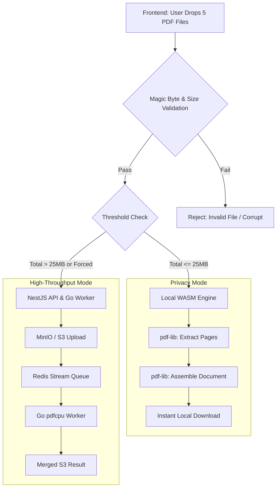

# ⭐ Merge PDF Engine Specification (v2.1)

> **Module:** Multi-Document Assembly
> **Primary Interfaces:** `/merge-pdf` (Frontend), `POST /conversions/initiate` (Backend)
> **Engine Backbone:** `pdf-lib` (WASM Client) & `pdfcpu` (Go Worker)

---

## 1. Executive Summary

The Merge PDF feature empowers users to combine multiple PDF documents into a single, unified file. To preserve KrocPDF's core commitment to **zero-knowledge privacy**, this feature relies on a **Smart Auto-Fallback Dual-Engine Architecture**. 

- **Local Privacy Mode:** Small-to-medium batches (< 25MB total, < 15 files) execute instantaneously within the user's browser via `pdf-lib`.
- **Cloud Batch Mode:** Massive batches (up to 100MB per file) dynamically stream to the Go 1.25 Worker (`pdfcpu`) via Redis, tracking progress with Server-Sent Events (SSE).

---

## 2. Component Wirecharts & Flow Diagrams

### Client Drag-and-Drop & Routing Strategy


---

## 3. Data Contracts & Gateway API (Option A: Unified Gateway)

Rather than maintaining isolated endpoints, the Merge PDF engine extends the monorepo's unified orchestration endpoint (`POST /conversions/initiate`).

### Incoming Request (Frontend $\rightarrow$ Gateway)
```json
{
  "jobType": "MERGE_PDF",
  "files": [
    {
      "fileName": "Q3_Report_Part1.pdf",
      "mimeType": "application/pdf", // STRICT ENFORCEMENT: If jobType===MERGE_PDF, NestJS class-validator rejects any non-pdf types.
      "sizeBytes": 4501230
    },
    {
      "fileName": "Q3_Report_Appendices.pdf",
      "mimeType": "application/pdf",
      "sizeBytes": 890100
    }
  ]
}
```

### Redis Stream Payload (`conversion_jobs`)
```json
{
  "job_id": "m1x9f0e2-8b3d-4e5f-9a1c-7d8e9f0a1b2c",
  "job_type": "MERGE_PDF",
  "s3_keys": [
    "uploads/m1x9f0e2/0_Q3_Report_Part1.pdf",
    "uploads/m1x9f0e2/1_Q3_Report_Appendices.pdf"
  ],
  "output_key": "outputs/m1x9f0e2/krocpdf_merged.pdf"
}
```

---

## 4. Binary Validation & Security Guarantees

We cannot blindly pass binaries to parsing engines. KrocPDF enforces strict binary gates.

### The Two-Tier `%PDF-` Header Gate
To prevent polyglots, executable masking, and malformed files, both the frontend uploader and backend gateway perform immediate byte-level inspection:
1. **Header Validation:** The first 5 bytes must exactly match `0x25, 0x50, 0x44, 0x46, 0x2D` (`%PDF-`).
2. **Trailer Validation:** The EOF marker (`%%EOF`) is scanned for within the trailing 1024 bytes. *Note: This deliberately searches a 1KB window rather than enforcing strict exact-end placement, safely tolerating invisible garbage bytes or line breaks often appended by older physical scanners.*

*Files failing this gate are rejected in $<1\text{ms}$ before any parse trees are allocated in memory.*

### Zero-Knowledge & Ephemeral Storage
- **In-Browser Operations:** Files routed to `pdf-lib` never leave the user's `localhost`. Network inspection will confirm zero payload egress.
- **Cloud Operations:** Merged results stored in Cloudflare R2 / MinIO are subjected to a strict 24-hour TTL Bucket Lifecycle Rule, purging them unconditionally.

---

## 5. UI/UX: The Obsidian & Emerald Design
The Merge PDF interface features:
- **Interactive Card Queue:** Documents render as dynamic cards displaying total page counts.
- **Visual Reordering:** Powered by `@hello-pangea/dnd`, users drag cards to strictly define the sequential output array.
- **Aggregated Metadata (Memory-Aware):** Real-time display calculating the final merged file size and total combined page count. *Safety Threshold:* The frontend only parses page counts via `pdf-lib` if the batch qualifies for the local engine ($\le 25\text{MB}$). For massive cloud-routed batches, it skips local parsing to prevent memory crashes and displays "Calculating..." until the worker returns the final count.
